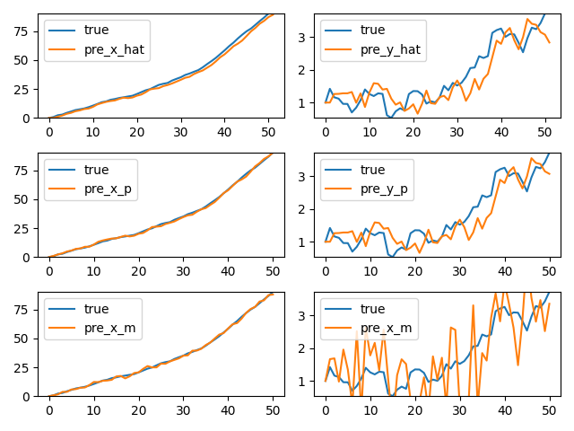
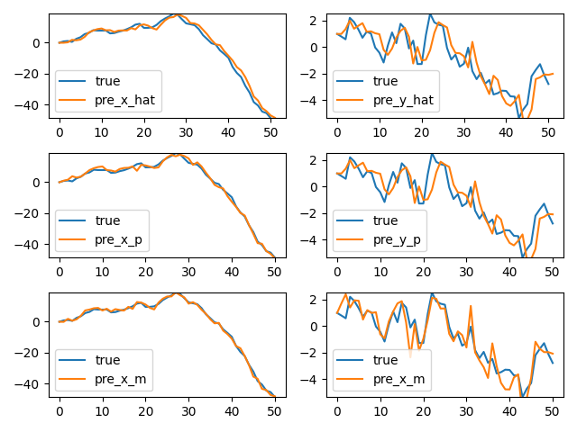

[English](README.md) | [简体中文](README.zh-CN.md)

Kalman Filter 🚀 is a mathematical algorithm that estimates the state of a system based on measurements. It uses a probabilistic model to iteratively update the state estimate, taking into account uncertainty and combining predicted and measured values. It is widely used in control theory, signal processing, and robotics.

This is an example of a simple Kalman filter with two variables, adapted from an instructional video on Bilibili. While the original tutorial demonstrated how to implement the filter in Excel, this version provides a Python implementation.

Please refer the original tutorial at **[[【卡尔曼滤波器】1_递归算法_Recursive Processing_哔哩哔哩_bilibili](https://www.bilibili.com/video/BV1ez4y1X7eR/?spm_id_from=333.788&vd_source=c2536ad84cd7a24998b36cdd72145bdc)]**.

Here is a simplified version to help you get started. Please feel free to correct any mistakes or offer suggestions for improvement.

You can get started with:

```commandline
pip install numpy
pip install matplotlib
```

Then, you can run Kalman Filter with:

```
python main.py
```

Finally, the result are shown below:

The three rows in the figure represent the posterior, prior and observed values, respectively.

```python
Q_convar = 1 # 过程噪声的协方差值
R_convar = 1 # 观测噪声的协方差值
```



```python
Q_convar = 1 # 过程噪声的协方差值
R_convar = 1 # 观测噪声的协方差值
```


